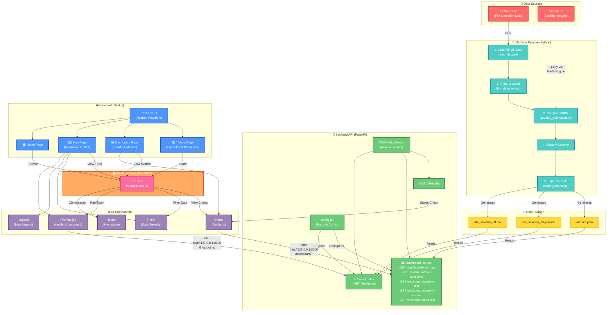
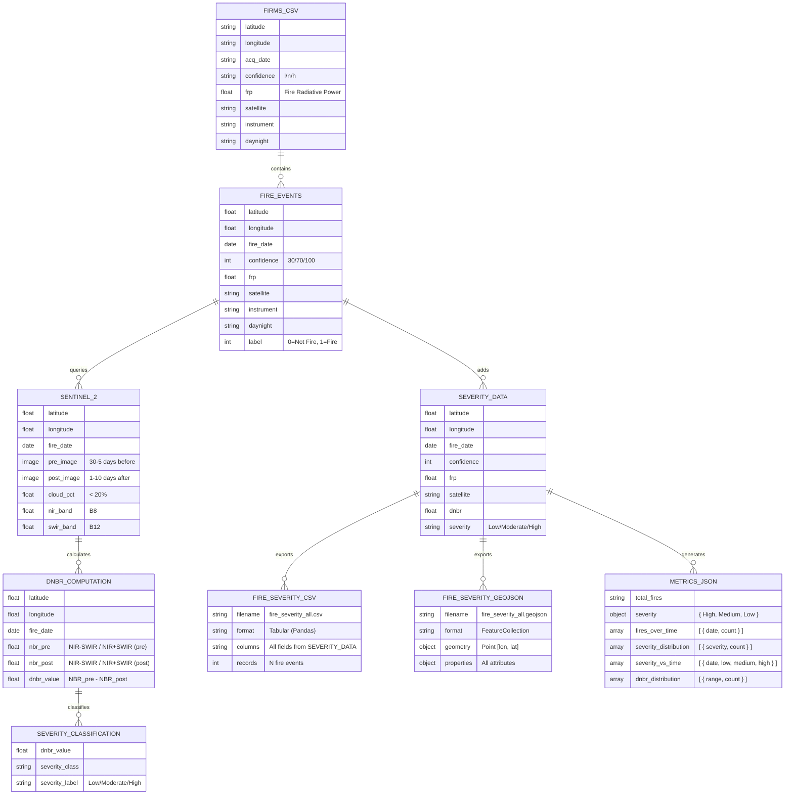
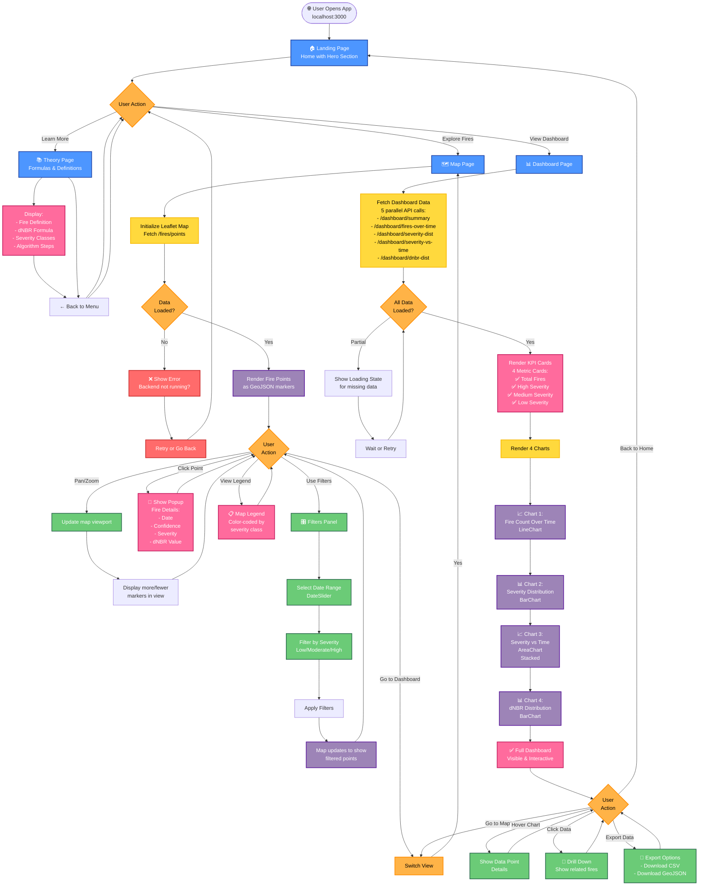

# Stubble Vision

Stubble Vision is a full-stack geospatial analytics platform for agricultural fire monitoring and burn severity assessment.

It combines:
- a Python data pipeline (FIRMS + Google Earth Engine processing),
- a FastAPI backend exposing GeoJSON and dashboard metrics,
- a Next.js frontend with map and chart-based visualizations.

## Table of Contents

1. [What This Project Does](#what-this-project-does)
2. [Architecture](#architecture)
3. [Repository Structure](#repository-structure)
4. [Tech Stack](#tech-stack)
5. [Prerequisites](#prerequisites)
6. [Quick Start](#quick-start)
7. [Run the Backend (FastAPI)](#run-the-backend-fastapi)
8. [Run the Frontend (Next.js)](#run-the-frontend-nextjs)
9. [API Reference](#api-reference)
10. [ML/Data Pipeline](#mldata-pipeline)
11. [Data Files Used by Backend](#data-files-used-by-backend)
12. [Configuration](#configuration)
13. [Troubleshooting](#troubleshooting)
14. [System Architecture Diagrams](#system-architecture-diagrams)
15. [Development Notes](#development-notes)

## What This Project Does

The system is focused on stubble-burning/fire intelligence by:
- ingesting fire data from FIRMS CSV files,
- computing burn severity signals (dNBR) using Sentinel-2 imagery,
- classifying events by severity,
- exporting outputs (CSV, GeoJSON, metrics),
- serving those outputs to a web dashboard and interactive map.

## Architecture

1. Data Pipeline (`ml/`)
	 - Loads FIRMS data.
	 - Cleans and filters likely fire events.
	 - Computes dNBR using Google Earth Engine.
	 - Exports `fire_severity_all.geojson` and `metrics.json`.

2. Backend API (`backend/`)
	 - FastAPI app serving:
		 - fire point GeoJSON,
		 - dashboard summary/time-series/distribution metrics.

3. Frontend (`frontend/`)
	 - Next.js app with:
		 - map view (`/map`),
		 - dashboard view (`/dashboard`),
		 - theory page (`/theory`),
		 - landing page (`/`).

## Repository Structure

```text
.
├── backend/                 # FastAPI app and API routes
│   ├── main.py
│   ├── config.py
│   └── routes/
│       ├── fires.py
│       └── metrics.py
├── data/
│   ├── firms/               # Input FIRMS CSV files
│   └── severity/            # Generated outputs (GeoJSON, metrics, CSV)
├── frontend/                # Next.js application
│   ├── src/app/
│   └── src/components/
├── ml/                      # Data processing and severity estimation pipeline
├── notebooks/               # Research/analysis notebooks
├── requirements.txt         # Python dependencies
└── README.md
```

## Tech Stack

- Backend: FastAPI, Uvicorn
- Frontend: Next.js 13, React 18, Chakra UI, Recharts, Leaflet
- Data/ML: Pandas, Google Earth Engine API, GeoJSON export utilities

## Prerequisites

- Python 3.10+
- Node.js 18+ and npm
- Google Earth Engine account (for running the ML pipeline)

Optional but recommended:
- `venv` for Python environment isolation

## Quick Start

Clone and enter the repository:

```bash
git clone https://github.com/Amritesh-co/Stubble_Vision.git
cd Stubble_Vision
```

Install backend/python dependencies:

```bash
python3 -m venv .venv
source .venv/bin/activate
pip install -r requirements.txt
```

Install frontend dependencies:

```bash
npm --prefix frontend install
```

Start backend (terminal 1):

```bash
uvicorn backend.main:app --reload --host 0.0.0.0 --port 8000
```

Start frontend (terminal 2):

```bash
npm --prefix frontend run dev
```

Open:
- Frontend: http://localhost:3000
- Backend docs: http://127.0.0.1:8000/docs

## Run the Backend (FastAPI)

From repository root:

```bash
source .venv/bin/activate
uvicorn backend.main:app --reload --host 0.0.0.0 --port 8000
```

Backend entrypoint: `backend/main.py`

Included route groups:
- `/fires/*`
- `/dashboard/*`

## Run the Frontend (Next.js)

```bash
npm --prefix frontend install
npm --prefix frontend run dev
```

Build for production:

```bash
npm --prefix frontend run build
npm --prefix frontend run start
```

## API Reference

Base URL: `http://127.0.0.1:8000`

### Health
- `GET /`
	- Basic service status and available endpoint list.

### Fires
- `GET /fires/points`
	- Returns all fire points as GeoJSON (`FeatureCollection`).
	- NaN/inf numeric values are sanitized to `null` before response.

### Dashboard
- `GET /dashboard/summary`
- `GET /dashboard/fires-over-time`
- `GET /dashboard/severity-distribution`
- `GET /dashboard/severity-vs-time`
- `GET /dashboard/dnbr-distribution`

## ML/Data Pipeline

Main pipeline script: `ml/runner.py`

Pipeline stages:
1. Load FIRMS CSV (`ml/load_data.py`)
2. Clean + label fire events (`ml/fire_detection.py`)
3. Compute dNBR and classify severity (`ml/severity_estimation.py`)
4. Export CSV, GeoJSON, and metrics (`ml/export_results.py`)

Run pipeline:

```bash
source .venv/bin/activate
python -m ml.runner
```

Expected output artifacts under `data/severity/`:
- `fire_severity_all.csv`
- `fire_severity_all.geojson`
- `metrics.json`

## Data Files Used by Backend

Configured in `backend/config.py`:
- `data/severity/fire_severity_all.geojson`
- `data/severity/metrics.json`

The backend serves these files directly through API routes.

## Configuration

Environment values read by backend (`backend/config.py`):
- `BACKEND_HOST` (default: `0.0.0.0`)
- `BACKEND_PORT` (default: `8000`)

Current frontend API calls in source are hardcoded to:
- `http://127.0.0.1:8000`

If backend host/port changes, update frontend fetch URLs accordingly.

## Troubleshooting

### `next: command not found`

Cause: frontend dependencies are not installed.

Fix:

```bash
npm --prefix frontend install
```

### Backend fails on startup with `metrics.json not found`

Cause: `backend/routes/metrics.py` currently uses an absolute machine-specific path.

Fix options:
- update that file to use paths from `backend/config.py`, or
- ensure metrics file exists at the configured absolute path.

### Frontend loads but charts/map are empty

Checks:
- backend is running on `127.0.0.1:8000`,
- required files exist in `data/severity/`,
- endpoints respond in browser/Postman (`/docs` is available).

## System Architecture Diagrams

### 1. Complete System Architecture & Workflow



### 2. ML Data Pipeline Workflow (Detailed)

```mermaid
graph LR
    Start([🚀 Run Pipeline<br/>python -m ml.runner]) --> LoadFIRMS["📥 Load FIRMS CSV<br/>load_data.py"]
    
    LoadFIRMS --> CheckFiles{FIRMS CSV<br/>Exists?}
    CheckFiles -->|No| Error1["❌ FileNotFoundError"]
    CheckFiles -->|Yes| ParseDF["Parse to DataFrame"]
    
    ParseDF --> CleanData["🧹 Clean Data<br/>fire_detection.py"]
    
    CleanData --> ConvertTypes["Convert dtypes<br/>lat/lon → float<br/>confidence → int"]
    ConvertTypes --> DropNA["Drop null<br/>coordinates"]
    DropNA --> CleanedDF["✅ Clean DataFrame"]
    
    CleanedDF --> CreateLabels["🏷️ Create Fire Labels<br/>confidence ≥ 70?"]
    CreateLabels --> LabeledDF["Binary Labels<br/>0=Not Fire, 1=Fire"]
    
    LabeledDF --> ExtractFires["🔥 Extract Fire Events<br/>Filter label=1"]
    ExtractFires --> FireEvents["Confirmed Fires"]
    
    FireEvents --> InitEE["🌍 Init Earth Engine<br/>severity_estimation.py"]
    InitEE --> EEReady["Earth Engine Ready<br/>project=stubble-vision-ee"]
    
    EEReady --> BatchLoop["Batch Processing<br/>BATCH_SIZE=50"]
    
    BatchLoop --> ForEachFire["For Each Fire Point"]
    ForEachFire --> Point["Get: lat, lon, date"]
    
    Point --> ComputeDNBR["📡 Compute dNBR"]
    ComputeDNBR --> BufferPoint["Buffer Point ±500m"]
    BufferPoint --> FetchS2Pre["Query Sentinel-2<br/>Pre-fire: -30 to -5 days"]
    FetchS2Pre --> FetchS2Post["Query Sentinel-2<br/>Post-fire: +1 to +10 days"]
    
    FetchS2Post --> CalcNBR["Calculate NBR<br/>NBR = (B8-B12)/(B8+B12)"]
    CalcNBR --> CalcdNBR["Calculate dNBR<br/>dNBR = NBR_pre - NBR_post"]
    CalcdNBR --> ReduceRegion["Reduce Region<br/>Mean dNBR Value"]
    
    ReduceRegion --> ClassSeverity["📊 Classify Severity<br/>classify_severity()"]
    
    ClassSeverity --> SeverityClass{dNBR Value}
    SeverityClass -->|< 0.1| Unburned["🟢 Unburned/Recovered"]
    SeverityClass -->|0.1-0.27| Low["🟡 Low"]
    SeverityClass -->|0.27-0.44| Moderate["🟠 Moderate"]
    SeverityClass -->|≥ 0.44| High["🔴 High"]
    
    Unburned --> AddRow["Add to Batch DataFrame"]
    Low --> AddRow
    Moderate --> AddRow
    High --> AddRow
    
    AddRow --> SaveBatch["💾 Save Batch CSV<br/>fire_severity_batch_X.csv"]
    SaveBatch --> NextBatch{More Batches?}
    NextBatch -->|Yes| BatchLoop
    NextBatch -->|No| CombineBatches["📦 Combine All Batches"]
    
    CombineBatches --> FinalDF["Final DataFrame:<br/>All fires + severity"]
    
    FinalDF --> ExportCSV["📊 Export CSV<br/>fire_severity_all.csv"]
    ExportCSV --> ExportGeoJSON["🗺️ Export GeoJSON<br/>fire_severity_all.geojson<br/>(FeatureCollection)"]
    ExportGeoJSON --> ExportMetrics["📈 Export Metrics<br/>metrics.json<br/>(summary, distributions)"]
    
    ExportMetrics --> Success["✅ PIPELINE COMPLETE"]
    
    Error1 --> Failed["❌ Pipeline Failed"]
    
    Success --> BackendReady["Backend Ready<br/>Serves via API"]
    BackendReady --> Serve["🔧 FastAPI Routes"]
    
    classDef input fill:#FF6B6B,stroke:#C92A2A,color:#fff,stroke-width:2px
    classDef process fill:#4ECDC4,stroke:#0B7285,color:#fff,stroke-width:2px
    classDef decision fill:#FFD93D,stroke:#F7B801,color:#000,stroke-width:2px
    classDef output fill:#6BCB77,stroke:#2D6A4F,color:#fff,stroke-width:2px
    classDef success fill:#95E1D3,stroke:#38A169,color:#000,stroke-width:2px
    classDef error fill:#FC6E51,stroke:#C92A2A,color:#fff,stroke-width:2px
    
    class Start,LoadFIRMS,InitEE input
    class CleanData,CreateLabels,ExtractFires,ComputeDNBR,ClassSeverity,CalcdNBR process
    class CheckFiles,SeverityClass,NextBatch decision
    class ExportCSV,ExportGeoJSON,ExportMetrics,SaveBatch output
    class Success,BackendReady,Serve success
    class Error1,Failed error
```



### 3. API Request/Response & User Interaction Flow

```mermaid
sequenceDiagram
    participant User as 👤 User Browser<br/>Port 3000
    participant Frontend as 🌐 Frontend<br/>(Next.js)
    participant API as 🔧 Backend API<br/>Port 8000<br/>(FastAPI)
    participant Files as 💾 Data Files<br/>data/severity/

    User->>Frontend: 1. Open localhost:3000
    Frontend->>Frontend: Render Layout + Navigation
    Frontend->>User: Display Home/Map/Dashboard
    
    User->>Frontend: 2. Click "Map" Page
    Frontend->>API: GET /fires/points
    Note over API: Load fire_severity_all.geojson
    API->>Files: Read GeoJSON
    Files-->>API: Return fire points
    Note over API: Sanitize NaN/inf → null
    API-->>Frontend: FeatureCollection JSON
    Frontend->>Frontend: Parse & render on Leaflet
    Frontend->>User: 🗺️ Interactive Map Display
    
    User->>Frontend: 3. Pan/Zoom/Interact Map
    Frontend->>Frontend: Update map view
    Frontend->>User: Show fire points on map
    
    User->>Frontend: 4. Click "Dashboard" Page
    Frontend->>API: GET /dashboard/summary
    API->>Files: Read metrics.json
    Files-->>API: summary data
    API-->>Frontend: {total_fires, severity{high/med/low}}
    Frontend->>Frontend: Render KPI cards
    
    par Parallel Dashboard Requests
        Frontend->>API: GET /dashboard/fires-over-time
        API->>Files: Read metrics.json (fires_over_time)
        Files-->>API: time series data
        API-->>Frontend: [{fire_date, count}, ...]
        Frontend->>Frontend: Render LineChart
        
        Frontend->>API: GET /dashboard/severity-distribution
        API->>Files: Read metrics.json (severity_distribution)
        Files-->>API: distribution data
        API-->>Frontend: [{severity, count}, ...]
        Frontend->>Frontend: Render BarChart
        
        Frontend->>API: GET /dashboard/severity-vs-time
        API->>Files: Read metrics.json (severity_vs_time)
        Files-->>API: stacked area data
        API-->>Frontend: [{date, low, medium, high}, ...]
        Frontend->>Frontend: Render AreaChart
        
        Frontend->>API: GET /dashboard/dnbr-distribution
        API->>Files: Read metrics.json (dnbr_distribution)
        Files-->>API: dNBR range data
        API-->>Frontend: [{range, count}, ...]
        Frontend->>Frontend: Render BarChart
    end
    
    Frontend->>User: 📊 Full Dashboard Loaded
    
    User->>Frontend: 5. Apply Filters
    Frontend->>Frontend: Update query params
    Frontend->>Frontend: Re-fetch & re-render
    
    User->>Frontend: 6. View Theory Page
    Frontend->>Frontend: Render static theory content
    Frontend->>User: 📚 Formula/Definition Blocks
    
    Note over User,API: End-to-End Flow Complete

    classDef userStyle fill:#FF6B9D,stroke:#C2185B,color:#fff,stroke-width:2px
    classDef frontendStyle fill:#4D96FF,stroke:#1D42A4,color:#fff,stroke-width:2px
    classDef apiStyle fill:#6BCB77,stroke:#2D6A4F,color:#fff,stroke-width:2px
    classDef storageStyle fill:#FFD93D,stroke:#F7B801,color:#000,stroke-width:2px
    
    class User userStyle
    class Frontend frontendStyle
    class API apiStyle
    class Files storageStyle
```

### 4. Deployment & Runtime Architecture

```mermaid
graph TB
    subgraph Development["🖥️ Development Environment"]
        Repo["Git Repository<br/>Stubble_Vision"]
        PythonEnv["Python venv<br/>3.10+"]
        NodeEnv["Node.js<br/>18+"]
    end

    subgraph DataLayer["📊 Data Layer"]
        FIRMSInput["FIRMS Input<br/>data/firms/<br/>*.csv"]
        Sentinel2["Sentinel-2<br/>API<br/>(via Earth Engine)"]
        DataDir["data/severity/<br/>Processing Output"]
        CSVOut["fire_severity_all.csv<br/>(Full fire records)"]
        GeoJSONOut["fire_severity_all.geojson<br/>(Map overlay)"]
        MetricsOut["metrics.json<br/>(Dashboard data)"]
    end

    subgraph BackendRuntime["🔧 Backend Runtime<br/>Port 8000"]
        PythonInterpreter["Python Interpreter"]
        FastAPP["FastAPI App"]
        MainModule["backend/main.py<br/>(Entry point)"]
        ConfigModule["backend/config.py<br/>(Paths & settings)"]
        FiresRoute["🔥 Fires Routes<br/>fires.py"]
        MetricsRoute["📊 Metrics Routes<br/>metrics.py"]
        CORSMiddleware["CORS Middleware"]
        UvicornServer["Uvicorn Server<br/>0.0.0.0:8000"]
    end

    subgraph FrontendRuntime["🌐 Frontend Runtime<br/>Port 3000"]
        NextServer["Next.js Server"]
        ReactApp["React Application"]
        Pages["App Pages:<br/>/, /map,<br/>/dashboard, /theory"]
        Components["UI Components:<br/>FireMap, Charts,<br/>Legend, Filters"]
        ChakraUI["Chakra UI<br/>Theme Provider"]
        Recharts["Recharts<br/>Visualization"]
        Leaflet["Leaflet<br/>Map Library"]
    end

    subgraph Networking["🌐 Network Layer"]
        HTTP["HTTP/REST API<br/>127.0.0.1:8000"]
        CORS_Policy["CORS Policy<br/>Allow all origins"]
        HealthEndpoint["Health Check<br/>GET /"]
    end

    subgraph ClientSide["💻 Client Side"]
        Browser["Web Browser<br/>(Chrome/FF/Safari)"]
        FrontendURL["http://localhost:3000"]
        BackendURL["http://127.0.0.1:8000"]
    end

    subgraph MLPipelineRuntime["🤖 ML Pipeline Runtime<br/>On-Demand Execution"]
        PyScript["python -m ml.runner"]
        LoadData["load_data.py"]
        FireDetection["fire_detection.py"]
        SeverityEst["severity_estimation.py<br/>(Earth Engine)"]
        ExportResults["export_results.py"]
    end

    subgraph DevTools["🛠️ Development Tools"]
        Git["Git Version Control"]
        NPM["npm<br/>Package Manager"]
        Pip["pip<br/>Package Manager"]
        Docker["Optional:<br/>Docker<br/>Container"]
    end

    FIRMSInput -->|CSV| MLPipelineRuntime
    Sentinel2 -->|API Queries| SeverityEst
    
    MLPipelineRuntime -->|Generates| CSVOut
    MLPipelineRuntime -->|Generates| GeoJSONOut
    MLPipelineRuntime -->|Generates| MetricsOut
    
    CSVOut --> DataDir
    GeoJSONOut --> DataDir
    MetricsOut --> DataDir
    
    Repo -->|Clone| PythonEnv
    PythonEnv -->|Contains| ConfigModule
    ConfigModule -->|Reads| DataDir
    
    PythonInterpreter -->|Runs| MainModule
    MainModule -->|Creates| FastAPP
    FastAPP -->|Includes| CORSMiddleware
    FastAPP -->|Routes| FiresRoute
    FastAPP -->|Routes| MetricsRoute
    FiresRoute -->|Reads| GeoJSONOut
    FiresRoute -->|Reads| CSVOut
    MetricsRoute -->|Reads| MetricsOut
    
    UvicornServer -->|Serves| FastAPP
    UvicornServer -->|Listens on| HTTP
    
    Repo -->|Clone| NodeEnv
    NodeEnv -->|npm install| ReactApp
    
    NextServer -->|Renders| Pages
    Pages -->|Uses| Components
    Components -->|Styled with| ChakraUI
    Components -->|Charts| Recharts
    Components -->|Maps| Leaflet
    
    ReactApp -->|Runs in| Browser
    Browser -->|Navigates| FrontendURL
    Browser -->|API Calls| BackendURL
    
    HTTP -->|fetch()| Components
    CORS_Policy -->|Enables| HTTP
    HealthEndpoint -->|Status| Browser
    
    Git -->|Version Control| Repo
    NPM -->|Manages| NodeEnv
    Pip -->|Manages| PythonEnv
    Docker -->|Optional Deployment| BackendRuntime
    
    PyScript -->|Generates| DataDir
    DataDir -->|Consumed by| BackendRuntime
    
    classDef dev fill:#B19CD9,stroke:#7851A9,color:#fff,stroke-width:2px
    classDef data fill:#FFD93D,stroke:#F7B801,color:#000,stroke-width:2px
    classDef backend fill:#6BCB77,stroke:#2D6A4F,color:#fff,stroke-width:2px
    classDef frontend fill:#4D96FF,stroke:#1D42A4,color:#fff,stroke-width:2px
    classDef network fill:#FF6B9D,stroke:#C2185B,color:#fff,stroke-width:2px
    classDef client fill:#FFB347,stroke:#FF8C00,color:#000,stroke-width:2px
    classDef ml fill:#4ECDC4,stroke:#0B7285,color:#fff,stroke-width:2px
    classDef tools fill:#E0AAC7,stroke:#C2185B,color:#000,stroke-width:2px
    
    class Development,Repo,PythonEnv,NodeEnv dev
    class DataLayer,FIRMSInput,Sentinel2,DataDir,CSVOut,GeoJSONOut,MetricsOut data
    class BackendRuntime,PythonInterpreter,FastAPP,MainModule,ConfigModule,FiresRoute,MetricsRoute,CORSMiddleware,UvicornServer backend
    class FrontendRuntime,NextServer,ReactApp,Pages,Components,ChakraUI,Recharts,Leaflet frontend
    class Networking,HTTP,CORS_Policy,HealthEndpoint network
    class ClientSide,Browser,FrontendURL,BackendURL client
    class MLPipelineRuntime,PyScript,LoadData,FireDetection,SeverityEst,ExportResults ml
    class DevTools,Git,NPM,Pip,Docker tools
```

### 5. Data Model & Schema



### 6. Technology Stack Overview

```mermaid
graph TB
    subgraph TechStack["🏗️ STUBBLE VISION - TECHNOLOGY STACK"]
        
        subgraph Frontend_Stack["🌐 Frontend Stack"]
            Framework["Next.js 13"]
            Library["React 18"]
            Styling["Chakra UI"]
            Charts["Recharts"]
            Maps["Leaflet + react-leaflet"]
            Math["KaTeX (Math Display)"]
            Utils["Framer Motion (Animations)"]
            Icons["react-icons"]
        end
        
        subgraph Backend_Stack["🔧 Backend Stack"]
            Framework_BE["FastAPI"]
            Server["Uvicorn"]
            Format["GeoJSON"]
            Middleware["CORS Middleware"]
            Lang["Python 3.10+"]
        end
        
        subgraph Data_ML_Stack["📊 Data & ML Stack"]
            DataProc["Pandas (Data Processing)"]
            GeoSpatial["Shapely (Geometry)"]
            EarthEngine["Google Earth Engine API"]
            Sentinel["Sentinel-2 Satellite Data"]
            NBR["dNBR Calculation<br/>(Burn Severity Index)"]
        end
        
        subgraph Deployment_Stack["🚀 Deployment Stack"]
            VCS["Git / GitHub"]
            Container["Docker (Optional)"]
            Package_NPM["npm (Frontend Deps)"]
            Package_PIP["pip (Python Deps)"]
            Env["python-dotenv (Config)"]
        end
        
        subgraph Utilities["🛠️ Utilities & Libraries"]
            CORS["fastapi.middleware.cors"]
            HTTPClient["requests library"]
            Typing["Python typing"]
            JSON["json module"]
        end
    end

    subgraph Dependencies["📦 Key Dependencies"]
        
        Frontend_Deps["Frontend:<br/>@chakra-ui/react<br/>recharts<br/>leaflet, react-leaflet<br/>framer-motion<br/>react-icons<br/>katex, react-katex"]
        
        Backend_Deps["Backend:<br/>fastapi==0.128.0<br/>uvicorn==0.40.0<br/>pandas==2.3.3<br/>numpy==2.4.1<br/>earthengine-api==1.7.4<br/>shapely==2.1.2"]
        
        Dev_Tools["Dev Tools:<br/>eslint<br/>next-lint<br/>python-box<br/>python-dotenv"]
    end

    subgraph APIs_Services["🔌 External APIs & Services"]
        FIRMS_API["🔥 FIRMS<br/>(Fire detection)"]
        S2_API["🛰️ Sentinel-2<br/>(via Google Earth Engine)"]
        GEE_API["🌍 Google Earth Engine<br/>(Geospatial processing)"]
        CORS_Browser["🌐 CORS<br/>(Browser requests)"]
    end

    subgraph Data_Format["📋 Data Formats"]
        CSV["CSV<br/>(Tabular data)"]
        GEOJSON["GeoJSON<br/>(Map visualization)"]
        JSON["JSON<br/>(API responses,<br/>Dashboard metrics)"]
    end

    subgraph Ports["🔌 Port Configuration"]
        Port3000["Frontend<br/>localhost:3000"]
        Port8000["Backend API<br/>127.0.0.1:8000"]
        Port8001["Alternative<br/>Backend"]
    end

    Framework --> Library
    Library --> Styling
    Library --> Charts
    Library --> Maps
    Charts --> Recharts
    Maps --> Leaflet
    Styling --> Framework
    Utils --> Framework
    Icons --> Framework
    Math --> Framework
    
    Lang --> Framework_BE
    Framework_BE --> Server
    Framework_BE --> Middleware
    Framework_BE --> Format
    
    DataProc --> EarthEngine
    EarthEngine --> Sentinel
    Sentinel --> NBR
    GeoSpatial --> DataProc
    
    Frontend_Deps --> Framework
    Backend_Deps --> Framework_BE
    Dev_Tools --> Backend_Stack
    
    FIRMS_API --> DataProc
    S2_API --> EarthEngine
    GEE_API --> EarthEngine
    CORS_Browser --> Middleware
    
    DataProc --> CSV
    DataProc --> GEOJSON
    Framework_BE --> JSON
    
    Framework --> Port3000
    Server --> Port8000
    
    VCS --> Backend_Stack
    VCS --> Frontend_Stack
    Container -.->|Optional| Server
    Package_NPM -->|Installs| Framework
    Package_PIP -->|Installs| Lang
    Env -->|Configures| Backend_Stack
    
    classDef frontend_color fill:#4D96FF,stroke:#1D42A4,color:#fff,stroke-width:2px
    classDef backend_color fill:#6BCB77,stroke:#2D6A4F,color:#fff,stroke-width:2px
    classDef data_color fill:#FFD93D,stroke:#F7B801,color:#000,stroke-width:2px
    classDef deploy_color fill:#B19CD9,stroke:#7851A9,color:#fff,stroke-width:2px
    classDef util_color fill:#FF6B9D,stroke:#C2185B,color:#fff,stroke-width:2px
    classDef api_color fill:#4ECDC4,stroke:#0B7285,color:#fff,stroke-width:2px
    classDef format_color fill:#FFB347,stroke:#FF8C00,color:#000,stroke-width:2px
    classDef port_color fill:#95E1D3,stroke:#38A169,color:#000,stroke-width:2px
    
    class Framework,Library,Styling,Charts,Maps,Math,Utils,Icons,Frontend_Deps frontend_color
    class Framework_BE,Server,Middleware,Format,Lang,Backend_Deps backend_color
    class DataProc,GeoSpatial,EarthEngine,Sentinel,NBR,Data_ML_Stack data_color
    class VCS,Container,Package_NPM,Package_PIP,Env,Deployment_Stack deploy_color
    class CORS,HTTPClient,Typing,JSON,Utilities util_color
    class FIRMS_API,S2_API,GEE_API,CORS_Browser,APIs_Services api_color
    class CSV,GEOJSON,JSON,Data_Format format_color
    class Port3000,Port8000,Port8001,Ports port_color
```



### 7. User Journey & Interaction Flow



### 8. Error Handling & Recovery Flows

```mermaid
graph TD
    subgraph Frontend_Errors["🌐 Frontend Error Handling"]
        FE_Start["Component Mount/<br/>API Call"]
        FE_Fetch["Attempt Fetch"]
        FE_Success{Response<br/>OK?}
        FE_Success -->|Yes| FE_Parse["Parse JSON"]
        FE_Parse --> FE_Render["Render Data"]
        FE_Render --> FE_Done["✅ Display"]
        
        FE_Success -->|No| FE_404["404:<br/>Not Found"]
        FE_404 --> FE_404_Handle["Show Message:<br/>Data not available"]
        FE_404_Handle --> FE_Retry1["Offer Retry"]
        FE_Retry1 --> FE_Fetch
        
        FE_Success -->|No| FE_500["500:<br/>Server Error"]
        FE_500 --> FE_500_Handle["Show Alert:<br/>Backend issue"]
        FE_500_Handle --> FE_Retry2["Retry or Go Back"]
        FE_Retry2 --> FE_Fetch
        
        FE_Fetch -->|Network<br/>Error| FE_NETWORK["❌ Network<br/>Unreachable"]
        FE_NETWORK --> FE_NET_MSG["Show Error:<br/>Backend down?<br/>Check localhost:8000"]
        FE_NET_MSG --> FE_Retry3["Retry"]
        FE_Retry3 --> FE_Fetch
        
        FE_Parse -->|Invalid<br/>JSON| FE_JSON_ERR["❌ JSON<br/>Parse Error"]
        FE_JSON_ERR --> FE_JSON_MSG["Log Error<br/>Show fallback UI"]
        FE_JSON_MSG --> FE_Done
    end
    
    subgraph Backend_Errors["🔧 Backend Error Handling"]
        BE_Route["API Route Called"]
        BE_Fetch_File["Attempt Read File"]
        BE_Check{File<br/>Exists?}
        
        BE_Check -->|Yes| BE_READ["Read File"]
        BE_READ --> BE_SANITIZE["Sanitize NaN/inf<br/>→ null"]
        BE_SANITIZE --> BE_JSON["Convert to JSON"]
        BE_JSON --> BE_200["✅ 200 OK<br/>Return Data"]
        
        BE_Check -->|No| BE_404_FILE["❌ FileNotFoundError"]
        BE_404_FILE --> BE_404_RES["HTTPException<br/>status: 404<br/>detail: File path"]
        BE_404_RES --> BE_Retry_FILE["Client retry/check"]
        
        BE_READ -->|Permission<br/>Error| BE_PERM["❌ Permission<br/>Denied"]
        BE_PERM --> BE_PERM_MSG["HTTPException<br/>status: 403"]
        BE_PERM_MSG --> BE_PERM_FIX["Fix file perms<br/>chmod 644"]
        
        BE_JSON -->|Encode<br/>Error| BE_ENC["❌ Encoding<br/>Error"]
        BE_ENC --> BE_ENC_MSG["HTTPException<br/>status: 500<br/>Sanitization failed"]
        BE_ENC_MSG --> BE_DEBUG["Check logs<br/>for NaN/inf"]
        
        BE_Route -->|CORS<br/>Check| BE_CORS_CHECK{Origin<br/>Allowed?}
        BE_CORS_CHECK -->|Yes| BE_FETCH_FILE
        BE_CORS_CHECK -->|No| BE_CORS_ERR["❌ CORS<br/>Error"]
        BE_CORS_ERR --> BE_CORS_MSG["Browser blocks<br/>request"]
        BE_CORS_MSG --> BE_CORS_FIX["Check CORS config<br/>in main.py"]
    end
    
    subgraph ML_Errors["🤖 ML Pipeline Errors"]
        ML_START["Run Pipeline"]
        ML_LOAD["Load FIRMS CSV"]
        ML_LOAD_ERR{File<br/>Found?}
        
        ML_LOAD_ERR -->|No| ML_FIRMS_ERR["❌ FileNotFoundError<br/>data/firms/*.csv"]
        ML_FIRMS_ERR --> ML_FIRMS_FIX["Place CSV in<br/>data/firms/"]
        
        ML_LOAD_ERR -->|Yes| ML_CLEAN["Clean Data"]
        ML_CLEAN --> ML_NULL{Null<br/>Values?}
        
        ML_NULL -->|Some| ML_DROP["Drop null rows"]
        ML_DROP --> ML_LABEL["Create Labels"]
        
        ML_NULL -->|None| ML_LABEL
        
        ML_LABEL --> ML_EE["Init Earth Engine"]
        ML_EE --> ML_EE_AUTH{EE<br/>Auth?}
        
        ML_EE_AUTH -->|Failed| ML_EE_ERR["❌ EE Auth Error"]
        ML_EE_ERR --> ML_EE_FIX["Run: earthengine auth<br/>Set project name"]
        ML_EE_FIX --> ML_EE
        
        ML_EE_AUTH -->|Success| ML_BATCH["Batch Process"]
        ML_BATCH --> ML_COMPUTE["Compute dNBR"]
        ML_COMPUTE --> ML_COMPUTE_ERR{S2 Data<br/>Found?}
        
        ML_COMPUTE_ERR -->|No| ML_S2_ERR["❌ No Sentinel-2<br/>Data"]
        ML_S2_ERR --> ML_S2_MSG["Cloud cover<br/>too high or<br/>no imagery"]
        ML_S2_MSG --> ML_SKIP["Skip point<br/>dNBR=None"]
        
        ML_COMPUTE_ERR -->|Yes| ML_CLASS["Classify<br/>Severity"]
        ML_SKIP --> ML_EXPORT
        
        ML_CLASS --> ML_EXPORT["Export Results"]
        ML_EXPORT --> ML_EXPORT_ERR{Write<br/>Success?}
        
        ML_EXPORT_ERR -->|No| ML_OUT_ERR["❌ Export Error<br/>Disk full?<br/>Perms?"]
        ML_OUT_ERR --> ML_OUT_FIX["Check disk space<br/>Check perms<br/>data/severity/"]
        ML_OUT_FIX --> ML_EXPORT
        
        ML_EXPORT_ERR -->|Yes| ML_SUCCESS["✅ Export Complete<br/>Files ready<br/>for backend"]
    end
    
    subgraph Recovery["🔄 Recovery & Fixes"]
        REC_BACKEND["Backend Won't Start"]
        REC_BACKEND --> FIX_B1["Check port 8000<br/>not in use"]
        FIX_B1 --> FIX_B2["Verify metrics.json<br/>path correct"]
        FIX_B2 --> FIX_B3["Try: uvicorn<br/>backend.main:app<br/>--reload"]
        
        REC_FRONTEND["Frontend Won't Load"]
        REC_FRONTEND --> FIX_F1["npm install<br/>dependencies"]
        FIX_F1 --> FIX_F2["Try: npm run dev<br/>from frontend/"]
        
        REC_MAP["Map Shows No Points"]
        REC_MAP --> FIX_M1["Check backend<br/>running"]
        FIX_M1 --> FIX_M2["Check GeoJSON<br/>exists & valid"]
        FIX_M2 --> FIX_M3["Check browser<br/>console for errors"]
        
        REC_DASH["Dashboard Empty"]
        REC_DASH --> FIX_D1["Check metrics.json<br/>created"]
        FIX_D1 --> FIX_D2["Run ML pipeline<br/>to regenerate"]
        FIX_D2 --> FIX_D3["Verify endpoints<br/>in /docs"]
    end
    
    classDef success fill:#95E1D3,stroke:#38A169,color:#000,stroke-width:2px
    classDef error fill:#FF6B6B,stroke:#C92A2A,color:#fff,stroke-width:2px
    classDef check fill:#FFD93D,stroke:#F7B801,color:#000,stroke-width:2px
    classDef fix fill:#B19CD9,stroke:#7851A9,color:#fff,stroke-width:2px
    classDef process fill:#4D96FF,stroke:#1D42A4,color:#fff,stroke-width:2px
    
    class FE_Done,FE_Render,BE_200,ML_SUCCESS success
    class FE_NETWORK,FE_JSON_ERR,BE_404_FILE,BE_PERM,ML_FIRMS_ERR,ML_EE_ERR,ML_S2_ERR,ML_OUT_ERR,BE_CORS_ERR,BE_ENC error
    class FE_Success,BE_Check,ML_LOAD_ERR,ML_NULL,ML_EE_AUTH,ML_COMPUTE_ERR,ML_EXPORT_ERR,BE_CORS_CHECK check
    class FE_404_Handle,FE_500_Handle,FE_NET_MSG,BE_404_RES,BE_PERM_FIX,BE_CORS_FIX,ML_FIRMS_FIX,ML_EE_FIX,ML_S2_MSG,ML_OUT_FIX,FIX_B1,FIX_B2,FIX_B3,FIX_F1,FIX_F2,FIX_M1,FIX_M2,FIX_M3,FIX_D1,FIX_D2,FIX_D3 fix
    class FE_Fetch,BE_SANITIZE,ML_CLEAN,ML_BATCH process
```



## Development Notes

- This repository currently contains generated files and some environment-specific assumptions.
- Prefer relative paths and centralized configuration in `backend/config.py` for portability.
- Before production deployment:
	- tighten CORS policy,
	- replace hardcoded API base URLs with environment variables,
	- add tests for backend endpoints and frontend data-loading flows.